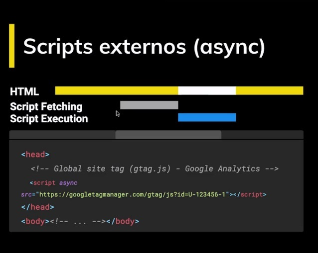
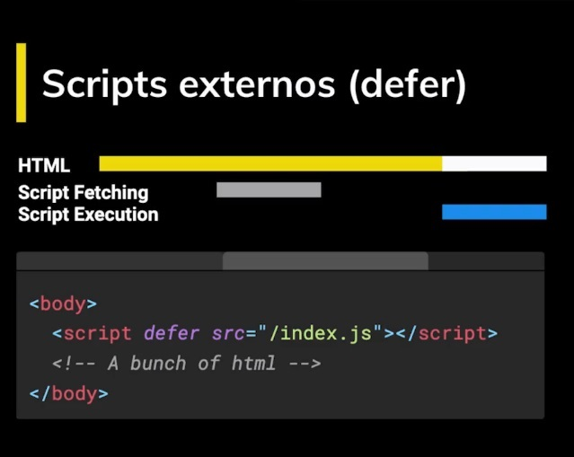
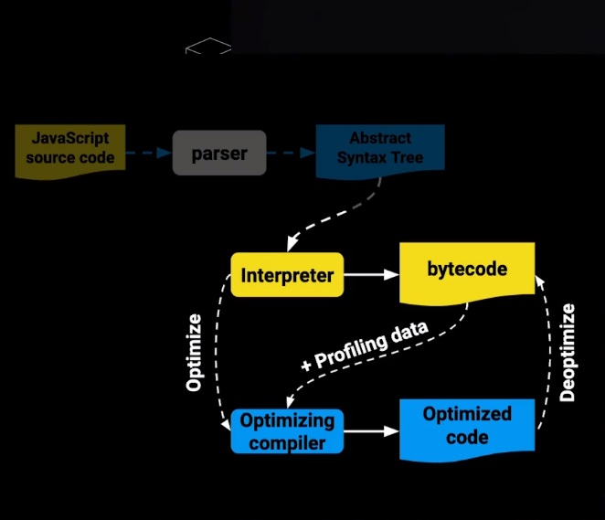
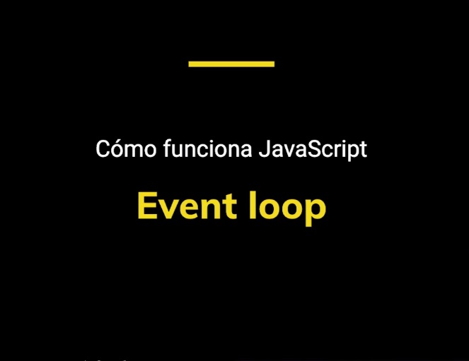

# JS Profesional - Platzi

<div align="center">
  
  <h2 align="center">Ser un profesional es un duro camino lleno de experiencias</h2>
</div>

## Index
- [쯈ué forma a un profesional?](#qué-forma-a-un-profesional)
  - [El lenguaje JavaScript](#el-lenguaje-javaScript)
  - [No fundamentos](#no-fundamentos)
  - [Como funciona](#como-funciona)
  - [Entornos de programación](#entornos-de-programación)
  - [Versado en código](#versado-en-código)
  - [Mejores prácticas](#mejores-prácticas)
  - [Ética](#Ética)
  - [Experiencia](#Experiencia)
-[Como llega un script al navegador](#como-llega-un-script-al-navegador)
  - [DOM](#DOM)
  - [Scripts](#scripts)
  - [Scripts embebidos](#scripts-embebidos)
  - [Scripts externos](#scripts-externos)
- [Scope](#Scope)
  - [Global scope](#global-scope)
  - [Function scope](#function-scope)
  - [Block scope](#block-scope)
  - [Module scope](#module-scope)
- [Closures](#closures)
  - [IIFE](#iife)

## 쯈ué forma a un profesional?
* Conocimiento del lenguaje
* Conocimiento de los entornos de programación
* Mejores Prácticas
* Versado en código
* Herramientas
* Ética / Profesionalismo
* Experiencia

### El lenguaje JavaScript
* Fundamentos
* No fundamentos
* Cómo funciona

### No fundamentos
* Promesas (Nivel Pro)
* Getters, Setters
* Proxies
* Generadores

### Como funciona
* Javascript Engine
* Herencia prototipal
* Event Loop

### Entornos de programación
* Browser
* DOM Api

### Versado en código
* Hay que leer código
* Mucho
* Constantemente

### Mejores prácticas
* No reinventamos la rueda
* Probamos nuestro código

### Ética
* Ser responsable
* Entregar a tiempo
* Saber decir que no
* No hacer daño

### Experiencia
* Nada le gana a esto
* No se puede enseñar
* Está en ti
* Perseverancia

<div align="center">
  
</div>

<div align="right">
  <small><a href="#index">🡡 volver al inicio</a></small>
</div>

## Como llega un script al navegador

### DOM

Es la representación de un archivo HTML en un objeto

<div align="center" style="padding: 8px 0">
  
</div>

Cuando el navegador recibe HTML, recibe todo esto y lo procesa, convirtiendola a una estructura de arbol

<div align="center" style="padding: 8px 0">
  
</div>

Cuando termina de procesarlo es que ocurre el evento **DOMContentLoaded**

<div align="right">
  <small><a href="#index">🡡 volver al inicio</a></small>
</div>

### Scripts

Script es una etiqueta como cualquier otra, es un elemento

Pero no todos los scripts son iguales

Veamos este ejemplo, tenemos un script con el atributo async y que como source trae google analitycs y otro script embebido tiene 4 lineas

<div align="center" style="padding: 8px 0">
  
</div>

<div align="right">
  <small><a href="#index">🡡 volver al inicio</a></small>
</div>


### Scripts embebidos 

Cuando el DOM se este procesando y se encuentre con una etiqueta script va a detener todo el procesamiento
hasta que esta termine su ejecución

<div align="center" style="padding: 8px 0">
  
</div>

Donde ponemos los scripts son importantes

Consideremos este ejemplo

<div align="center" style="padding: 8px 0">
  
</div>

Si corremos este codigo... PAMP

<div align="center" style="padding: 8px 0">
  
</div>

Dijimos que el procesamiento de HTML se detiene y al ejecutarse el script la etiqueta form no existe por lo que genera un TyperError

Solucion poner el form antes del script

<div align="center" style="padding: 8px 0">
  
</div>

<div align="right">
  <small><a href="#index">🡡 volver al inicio</a></small>
</div>

### Scripts externos
Sucede lo mimo cuando se hace un fetching de datos, el DOM se detiene cuando llega al script y no es hasta que se cumpla que el HTMl se seguira procesando

<div align="center" style="padding: 8px 0">
  
</div>

Ahora se le puede dar un atributo async a los fetching externos, con esto la peticion va a ocurrir asyncronamente sin interrumpir el proceso del DOM, so se detendra cuando se cumpla y se ejecute el script

<div align="center" style="padding: 8px 0">
  
</div>

쯈ué pasa si yo tengo 2 scripts asincronos?

<div align="center" style="padding: 8px 0">
  
</div>

Tenemos una 3ra forma para traer archivos externos - defer,
Similar al async, el fetching de datos no dentendra el proceso del DOM pero la ejecución ocurrira al final

<div align="center" style="padding: 8px 0">
  
</div>

<div align="right">
  <small><a href="#index">🡡 volver al inicio</a></small>
</div>

## Scope
Por desgracia JavaScript no siempre a tenido el mejor sistema de scope de variables

El Scope o ámbito es lo que define el tiempo de vida de una variable, en que partes de nuestro código pueden ser usadas

### Global scope
Variables disponibles de forma global se usa la palabra var, son accesibles por todos los scripts que se cargan en la página. Aquí hay mucho riesgo de sobreescritura

### Function scope
Variables declaradas dentro de una función sólo visibles dentro de ella misma (incluyendo los argumentos que se pasan a la función)

### Block scope
Variables definidas dentro de un bloque, por ejemplo variables declaradas dentro un loop while o for Se usa let y const para declarar este tipo de variables

### Module scope
Cuando se denota un script de tipo module con el atributo type="module las variables son limitadas al archivo en el que están declaradas

<div align="right">
  <small><a href="#index">🡡 volver al inicio</a></small>
</div>

## Closures
Son funciones que regresan una función o un objeto con funciones que mantienen las variables que fueron declaradas fuera de su scope

Tambien podriamos decir que son una combinación del scope de una función y la función donde fue definida

**Ejemplo**

Generamos una función que retorna otra función con lo cual la variable __colorMessage__ no podra ser accedida ni modificada

```javascript
function makeColorPrinter(color) {
  let colorMessage = `The color is ${color}`

  return function () {
    console.log(colorMessage)
  }
}
```

Instanciamos la variable __greenColorPrinter__ usando nuestro closure

```javascript
let greenColorPrinter = makeColorPrinter('green')
greenColorPrinter() // The color is green
```

Ahora la variable __greenColorPrinter__ se convirtio en una función que recuerda el valor inicial

Los closures nos sirven para tener algo parecido a variables privadas, característica que no tiene JavaScript por default. Es decir encapsulan variables que no pueden ser modificadas directamente por otros objetos, sólo por funciones pertenecientes al mismo

### IIFE
Inmediately invoked function expressions

Invocamos la función inmediatamente y todo lo que tenga dentro no podra ser accedido ni modificado por el scope global

```javascript
(function() {
  var color = 'green'

  function printColor() {
    console.log(color)
  }

  printColor()
})()
```

Una de las razones para usarlas es para mantener la privavidad de los datos

Pero actualmente y gracias a ES6 ya no es necesario recurrir a este metodo ya que ahora tenemos la posibilidad de manejar el scope de bloque gracias a let y const

<div align="right">
  <small><a href="#index">🡡 volver al inicio</a></small>
</div>

## this
this se refiere a un objeto. Ese objeto es el que actualmente está ejecutando un pedazo de código
### Metodos
* call(this, var1, var2, ...)
  * Ejecuta la función
* apply(this, [var1, var2, ...])
  * Ejecuta la función y recibe los parametros en un array
* bind(this, var1, var2, ...)
  * crea una nueva función

## Como funciona JavaScript
쯈ué es lo que sucede cuando un script llega al navegador?
### Hablemos de la web
La web no siempre ha sido igual, y cuando llego js llego con Netscape
JS es interpretado (linea por linea a la vez)


Esto sigue siendo cierto pero de una manera totalmente nueva
### La web no es como antes
Y esta manera llego con Google Chrome


Google tenia una serie de productos sumamente complejos como Google Maps y necesitaba un navegdor que fuera capaz de ejecutar las cosas mas eficientemente y por eso reinvento como funcionaban los motores de JS.
En resumen esto es lo que hace:


Veamos un gráfico de este orden


Que eventualmente va a producir el machine code, esto lo hace el optimizing compiler.
En algunas ocaciones esto puede fallar, y desoptimizamos el código.

Pero por ahora nos vamos a centrar en  el Parser y en el Abstract Syntax tree
### 쯈ué hace un parser?


Un parser va a agarrar un código fuente y lo va a leer, pero lo que tu estas escribiendo no es lo que la computadora entiene, primero lo va a descomponer y lo que salga de esa descomposicion se llaman  token.
Token identifican que let y new son palabras, que +, -, * son operadores etc, una vez tenemos esos tokens vamos a hacer el AST.
쯈ué pasa si el parser esta analizando tu programa y encuentra algo que no entiende?
Juto ahi ocurre un syntax error


Recordemos que los lenguajes de programación son lenguajes formales, muy estrictos si violamos una regla no hay forma de saber que querias hacer.
El proceso de parcing es importante que se haga bien.


Google nos dice que el parcing es 15% al 20% del proceso de ejecución. lo que quiere decir que mientras maás mgrande es tu proyecto más va a tardar el parcing.

### Parser de V8
Existen 2 modos de hacer paring, lo que hace el motor de google chrome o el de node que son los mismos V8


Podemos ver [esprima](https://esprima.org/demo/parse.html) para ver como procesa la información el parser


### AST
Es una estructura en forma de arbol, donde vamos a tener una raiz que va a ser nuestro programa y lo vamos a ir descomponiendo en partes, todo esto lo vamos a hacer siguiendo los tokens que produjo el parser.
* Ejemplos
 * Babel
 * Prettier


Podemos entrar a [AST explorer](https://astexplorer.net) y crear una regla de Eslint usando AST
```javascript
export default function(context) {
  return {
    VariableDeclaration(node) {
      // tipo de variable const
      if(node.kind == "const") {
        const declaration = node.declarations[0];
        console.log(typeof declaration.init.value)
        // asegurarnos que el valor es un número
        if(typeof declaration.init.value === "number") {
        	if(declaration.id.name !== declaration.id.name.toUpperCase()) {
            	context.report({
                	node: declaration.id,
                  	message: "El nombre de la constante debe estar en mayúsculas",
                  	fix: function(fixer) {
                    	return fixer.replaceText(declaration.id, declaration.id.name.toUpperCase())
                    }
               	})
            }
        }
      }
    }
  };
};

```


### JS Engine 


Despues de que el parser hizo su trabajo y nos dio el AST continua el interpretador para tener código optimizado


Ahora vamos a estar produciendo algo llamado bytecode, que sera lo que ejecuta el motor de JS y a su vez va a producir código optimizado.



Cuando el bytecode se esta ejecutando, un observador estara tomando notas, y cuando tiene suficientes notas, tomara deciciones para optimizar tú código, si algunas de estas observaciones en el futuro resultan ser falsa tu código regresara una versión optimizada anterior.

Comparemos que es bytecode contra machinecode, que es lo que sucede cuando hacemos código optimizado


Cuando el motor de JS V8 que son usados por chrome y node, produce este códigova a crearlo a machine code


Veamos un prógrama que esta en medio del bytecode y del optimizador, el profiling toma observación de la ejecución del bytecode y cuando ve que las funciones se estan llamando igual una vez tras otra tras otra, puede hacer alguna optimizaciones
Un Ejemplo:


Cuando la función ha sido usada 10 20 30 100 veces va a ponerse caliente


Luego 100 ves más, mas caliente


Luego super caliente


y entonces ya esta listo para ser optimizado


en terminos de v8 se le dice "is a hot function"


Esto significa que el optimizador de código esta listo para optmizar esa parte a machinecode

### Motorores  de JS
#### V8 (Chorme)


#### SpiderMonkey (Firefox)
tiene 2 capas de optimización


#### Chakra (Edge)


#### JavaScript Core (Safari)
Tiene 3 capaz de optimizacion


Esto no quiere decir que safari sea más rapido que chrome

### Event Loop


Es lo que hace parecer a JS Mutlihilo cuando realmente es un solo hilo.
Entonces como podemos hacer multiples eventos a la vez si solo tenemos un hilo

Tenemos que entender que JS se organiza usando 2 estructura de datos


- El Stack es el que lleva rastro de donde esta el programa..
- Tambien tenemos el Memory Head que es una estructuta desorganizada

#### Stack
El stack comienza vacio


Pero haciendo una opreación llamado push, imagines que cada push seria un plato


Un puh tras otro push, un plato sobre otro plato


Si deseas quitar algun plato, solo lo podras hacer quitando los que esten por encima, y ha este proceso se le llama Pop


Se puede realizar hasta dejar el Stack vacio


EL Stack es donde estan nuestras funciones, registro de como esta openando nuestro programa, apunta a variables como el scope


Entonces si tenemos un programa como este podemos ver como va cambiando el stack, iniciamos con anonimous ya que el programa no tiene un nombre


Lo primero que se ejecuta es main, por lo cual se suma al stack


Y esta ejecuta primeramente a hello, por lo cual tambien se suma al stack


Y este ejecuta un console log


Una vez termina volvemos a main


Y ahora se ejecta world con su console log


Luego volvemos a main, que ya no tiene nada que ejecutar por lo que volvemos a anonymous y termina el programa


Ahora veamos un prógrama asíncrono


hasta el momento hemos ejecutado el programa hasta el setTimeout el cual es asincrono, asique se continua con  el console.log('world')


Se acabo la función


hacemos Pop de todo el Stack


eventualuamente tenemos que volver al stack para ejecutar el setTimeout


y volvemos a salir y a vaciarl el stack


#### Queque

Si en el stack lo primero que entra es lo ultimo que sale en el queue lo primero que entra es lo primero que sale, Como en una fila del banco el primero que llega es el primero en ser atendido y en irse, y es eso, una fila.

Hablempos de la cola de Tareas, volvamos al ejemplo asincrono.


Cuando teniamos el setTimeout encolamos una tarea que se iba a hacer en 1 segundo


Terminan las tareas restantes y espera a que pase 1 segundo


Sacamos el evento de las tareas agendadas y lo pasamos al task queue


Y eventualmente volvera al stack, para que el programa siga ejecutandose y veamos el hello que quedo retrasado, ya que era asincrono.
쮺칩mo pasa esto? Event Loop


El event loop es este script que esta entre medio del stack y la cola de tareas que todo el tiempo esta viendo si hay tareas. y la otra pregunta que se hace es si esta vacio el stack, si esta vacio agarra las tareas del task queue y las pondra en el stack, y se ejecutara la función.


  
En este caso tenemos un setTimeout de 0(agendada ya que es asincrono) por lo que sera al instante


Asi que tan pronto lo ponga sale del stack, se va a la agenda(scheduled tasks) y de inmeditato a la cola de tareas (task queue)


Pero mi programa no a acabado y recordemos el event loop siempre esta pregintando si existe alguna tarea en la cola de tareas y si encuentra algo pregunta si el stack esta vacio, y si no lo estas pues espera que termine el stack se vacie(termine el programa).


Event Loop: Esta vacio? Esta vacio? Esta vacio? Esta vacio?
Stack: Nope, awanta


Event Loop: Esta vacio? Esta vacio? Esta vacio?
Stack: seeee


Event Loop: Ahi te voy :V


Se ejecuta y termina el programa


Un ultimo ejemplo, ahora con 2 tareas agendadas


#### Promesas
Son Promesas de que algo eventualemte sucedera (asincrono)


Pues resulta que las tareas de promesas van en otra cola (cola de micro tareas)


Ya que el setTimeout es inmediato, inmediatamente se va a al cola de tareas


Se vacia el Stack


Lo que hara event loop es agarran de las micro tareas


Lo ejecutara y se vaciara el stack


Agarra la segunda micro tarea


Lo ejecutara y volvera a vaciar el stack


Y ahora si vamos a la cola de tareas


Lo ejecutara y volvera a vaciar el stack terminando asi el programa


## Getters nad Setters
Uno de los featureds modernos que trae javascript se llaman getters and setter, que son funciones que podemos usar dentro de objetos que nos permiten tener propiedades virtuales, es decir no es una propiedad que exista directamente en el objeto pero atravez de un getter podemos tener una funcion que va a calcular estos valores, o travez de un setter va a usar un valor para establecer este nuevo valor.

Los getters y setters son funciones que podemos usar en un objeto para tener propiedades virtuales. Se usan los keywords set y get para crear estas propiedades.

Estas propiedades al ser funciones pueden llevar una validación de por medio y ser usadas con el operador de asignación como si fueran una variable más dentro del objeto.

## Proxy
Proxy también es un featured reciente del lenguaje, que igual que los getters y setter nos permite intersectar llamadas a un objeto, sin embargo mas alla de set y get podemos intersectar muchisimas otras cosas.

Documentancion de [Proxy!](https://developer.mozilla.org/es/docs/Web/JavaScript/Referencia/Objetos_globales/Proxy)

El proxy sirve para interceptar la lectura de propiedades de un objeto (los get, y set) entre muchas otras funciones. Así, antes de que la llamada llegue al objeto podemos manipularla con una lógica que nosotros definamos.

## Generators
Los generadores son funciones especiales, podemos comenzar su ejecución y detenerlo a la mitad, el programa continua y luego podemos regresar a esta función y continuar su ejecución donde la dejamos, lo que es interesante de los generadores es que cuando se detienen recuerdan su contexto, cuales era sus variables en su scope.

Los generadores son funciones especiales, pueden pausar su ejecución y luego volver al punto donde se quedaron recordando su scope.

Algunas de sus características:

* Los generadores regresan una función.
* Empiezan suspendidos y se tiene que llamar next para que ejecuten.
* Regresan un value y un boolean done que define si ya terminaron.
* yield es la instrucción que regresa un valor cada vez que llamamos a next y detiene la ejecución del generador.

## Abort Controller
Un nuevo featured que envia una señal a una petición fetch para que se detenga

La peticiones AJAX permitieron en su tiempo hacer peticiones asíncronas al servidor sin tener que detener la carga de la página. Hoy en día se utiliza la función fetch para esto.

Con fetch tenemos algo llamado AbortController que nos permite enviar una señal a una petición en plena ejecución para detenerla.

## Intersection Observer
Intersection Observer lo que hace es que se pone a observar un elemento y va a a estar viendo cual es su posicion, meidante un objeto de condiguración podemos definir unas marcas si el objeto esta en intersección de 25% (ejemplo) con respecto a la pantalla dejanos saberlo, ya sea cuando se este llendo o cuando este regresando. 

Sirve para observar elementos y si cruzan un umbral que nosotros definimos nos lo va a notificar para tomar acción.

El umbral se define por el porcentaje que tiene intersección con el viewport, con la parte visible de nuestra página.

## Visibility Change
Un nuevo evento que es parte del Page Visibility API del DOM 

El visibilityChange forma parte del API del DOM llamado Page Visibility y nos deja saber si el elemento es visible, pude ser usado para ejecutar una acción cuando cambiamos de pestaña. Así podemos ahorrar batería y mejorar la UX.

## Service Worker
Una de las tendencias en las aplicaciones web son las PWA, y dentro de las muchas cosas que ofrecen estan que funcionen offline,  esto es posible gracias a service worker, una capa que va a vivir entre medio del navegador y del internet y va a hacer algo parecido a los proxys  que es intersectar peticiones. Con esto logramos que una vez que las peticiones salgan y antes de que regresen intersectarlas y guardar la información en cache, la proxima vez que ocurra la petición en vez de ir a un servidor la traera desde la cache.

Sirven para hacer que nuestras aplicaciones funcionen Offline.

Muy usados en las Progressive Web Apps (PWA) los ServiceWorkers son una capa que vive entre el navegador y el Internet.

Parecido a como lo hacen los proxys van a interceptar peticiones para guardar el resultado en cache y la próxima vez que se haga la petición tomar del cache ese resultado.

## TypeScript
TypeScript es un superset de JavaScript, nos va a permitir añadir tipado a nuestras variables y funciones, en js no se hace esto, no decimos que una variables es un numero o una funcion regresa un objeto.

TypeScript es un superset de JavaScript que añade tipos a nuestras variables ayudando así a la detección de errores de forma temprana y mejorando el autocompletado.

Los navegadores no entienden TypeScript así que lo vamos a transpilar a JavaScript usando Parcel.

### Tipos Básicos:
* boolean. Valor verdadero o falso.
* number. Números.
* string. Cadenas de texto.
* string[]. Arreglo del tipo cadena de texto.
* Array. Arreglo multi-tipo, acepta cadenas de texto o números.
* enum. Es un tipo especial llamado enumeración.
* any. Cualquier tipo.
* object. Del tipo objeto.
### Funciones
En Typescript podemos ser explícitos con el tipo de los argumentos y el tipo de retorno de una función.
### Interfaces 
Las interfaces nos permiten declarar la forma de un objeto y esto nos puede ayudar al autocompletado y con algunos erroes, definiendo los tipos de sus propiedades y si son opcionales o no.

## Singlenton con TS
Uno de los patrones de diseño de creación más populares es el patrón Singleton que restringe la creación de instancias de una clase a un objeto.

## Patrones de diseño


Los patrones de diseño son como recetas que resuelven probelmas que nos enfrentamos constantemente en diseño de software.


Los patrones de diseño van a resolver problemas dentro de un contexto recurrente


Este problema tiene que tener algunas limitaciones que existen dentro del contexto


Y la solución debe ser generica, no podemos crear un patrón de diseño que solo atienda a un problema muy específico, es una solución pero no un patron de diseño.


Patrón -> recurrente
De echo este ejemplo ya es un patrón llamado el observer Pattern


 
Veamos algunos


Esta pagina te describe distintos patrones(soluciones), y cada patron tiene un nombre, el problema, la solución


Esta página te muestras distitnas páginas en distintas resoluciones, pero realmente no son patrones de diseño ya que no estan categorizados, son simplemente una galleria de soluciones


History...
Su objetivo era ver los distintos patrones que repetian en la arquitectura no solo en la moderna, si no el la arquitectura de toda la historia, para asi poder construir un lenguaje, para referirse a una idea en particular.


La ganga de 4, 4 autores que escribieron el famoso libro design Patterns, y de aqui parte todo, se coje nlas ideas y se empiezan a utilizar y a seguir desarrollandolas


De que nos sirve usar patrones de diseño?


Pero no todo es perfecto


Los patrones como todo tipo de complejidad hay que evitarlos siempre y cuando sea necesario


Bueno


Recuerda no siempre estar pensando en patrones de diseño, deja que naturlmente surga la necesidad para usarlos, siemrpe vamos a querer que nuestro codigo sea simple y recordemos que los patrones de diseño van a añadir un nivel de complejidad

### Categorías de patrones de diseño
El libro design patterns definio la lista inicial de patrones de diseño del software


Los dividio en 3 categorías


Comencemos por 


Y esta es la lista de los diferentes patrones qeu pertenecen a esta categoría


El prototype ya lo hemos visto bastante asi que empezamos por builder


Como JQuery lo usa


Despues tenemos


Y su lista


Como JQuery usa el adapter


Y por ultimo


La lista es un poco más extensa 


Como JQuery usa el composite


#### Singleton
Singleton es un patron creacional, 


que te ayudara a que una clase solo sea capaz de crear una sola instancia de si misma y esa instancia va a ser siempre la misma


Para describir patrones de diseños siempre utilizamos una notación llamda UML, que se ve así


Lo que esta arriba representa el nombre de la clase, en la primera seccion vamos a encontrar sus propiedades y en la segunda sus métodos, tenemos la propeidad instance y hay 2 cosas, una es el signo negativo que indica que es una propiedad privada y tambien vemos que esta subrayada que significa que es una propiedad o método estatico, podemos identificar un constructor por que tiene el mismo nombre que la clase, pero podemos notar algo muy curiuoso y que es poco usual, que este constructor es privado por lo que no podemos llamar a ' new Singleton ' luego tenemos un método publico getInstance, que va a ver si existe una instancia y si no existe la va a crear y la va a regresar y si la volvemos a llamar a getInstance vamos a tener siempre la instancia que creo la primera vez.


Bien


Caso de uso


Por lo general no vamos a querer más de una instancia de mongoose ya que solo existe una base de datos, por lo que Singleton es la solución.
Podemos ver que lo que mongoose exporta es una instancia, ya que al momento de hacer un import este se cachea y si hacemos otro import en otro archivo obtendremos lo que estaba cacheado.
En este caso mongoose usa una alternativa al patron Singleton pero el resultado es el mismo esta exportando una instancia y como se cachea siempre se va a ofrecer la misma


### Patron Observer


Redux es una libreria muy popular para manejar estados, es muy común combinarla con react


El api es algo parecido a esto, vamos a a importar una funcion createStore con la cual vamos a inicializar el estado y definir algunos reducer, ya que tenemos el store podemos suscribir componentes, funciones que vamos a notificar cada vez que haya un cambio de estado, que ocurren a travez de acciones que se despachan, por ejemplo si tuvieramos un estado para contador y llega la accion de incrementar el contador va a incrementar en uno y este cambio se notifica a todo mundo y los componentes, funciones que les interese este cambio van a pedir getState


Si vemos el código fuente de redux, hay 2 seccion que estan en llaves que son importantes, la primera donde se reciven las acciones que se despachan, van a pasar a travez de reducer que van a tener una copia del estado y la acción, el reducer se va a encargar de modificar el estado produce un estado nuevo y luego se tiene que notificar a todos los que se suscribieron.
listener es otra palabra para observer


Cada listener se va a suscribir a travez del metodo suscribe, subscribe va a añadirlos a la lista cuando hay cambios de estado se les notifica, y tambien se le va a dar una funcion unsubscribe asi que cuando ya no les interesa la informacion se desuscriben,
redux implementa el patron **Observer**


En Node existe una libreria llamada EventEmitter en Standard Librarys.


 Esta tiene 3 funciones on, off y emit, estan funciones son otros nombres para suscribe, unsuscribe y notify, una implementación de observer


Algunas noticias...


Pero aun estan en stage 1, en borrador

### Patron Decorador
El decorator forma parte de la categoria patrones estructurales


Una analogia del mundo real
Imaginate que vas apple.com y quieres compara una mac, normalmente te encuentras 2 o 3 modelos 


Pero te imaginas que tengas 2 con caracteristicas similares pero con pequelas variaciones


y despues estas otras 2 que cuestan diferente son diferentes


y luego otras


y muchas otras


Imaginate programar todo esto en código, crear una clase base y de ahi extender, tengo 8 modelos y son diferentes, esto se hace algo inmantenible


O no...


....


Ahora vas a a tener que hacer 8 más


Esto es una real pesadilla


Si lo vemos en código se veria algo asi


Hola, si, si


Tendriamos que ir a cada clase a cambiar su comportamiento, y esto en contra de una buena practica


Aqui es donde entra el decorator, patron estructural


Asi es como se ve el uml del decorator


Pero no soy fan de esto, hay mucho menos en JS, asi que


ASi que vamos a verlo de la forma que lo hariamos en JS, Vamos a hacer con una tecnica llamada monkey patching, vamos a tener una  clase macbrook pro con una funcion withmemory y vamos a especificar la cantidad de memoria, y le vamos a pasar una instancia de una computadora que en este caso seria una macbook pro, en monkey patching lo que vamos a hacer es que a una instancia de una clase no a la clase en si, le vamos a remplazar su funcionalidad, el costo antes de cambiarlo cuando se calcula vamos a guardar el valor original del ocsto y vamos a decirle el costo ahora va a ser el costo de la memoria  y se lo vamos a sumar al costo original que tenemos guardado y esta va a ser nuestra nueva funcion


Asi que vamos a tener una instancia de una computadora modificada


Veamos otras formas


Veamos como algunas librerias utilizan decorator para hacer sus implementaciones, aqui esta memoize que viene con loadsh, memoize lo que hace es recibe una función y regresa una función nueva, la funcion nueva trae una tecnica que va hacer que sea más eficiente las ejecuciones donde los argumentos no hayan cambiado es decir si tenemos una ejecucion donde pasamos un argumento y ese argumento lo estamos pasando por primera vez pues al funcion original va a tener que hacer todo el computo por primera vez para ver cual es el valor que va a regresar, las veces subsiguientes que llamemos estra funcion con los mismos argumentos ya tenemos los resultados que habiamos guardado en un tipo de cache, tomamos el resultado de cache y lo regresamos no hay que ejecutar la funcion completa


Aqui esta el decorator de la funcion


Si los argumentos ya estan en cache simplemente regresamos la respuesta de lo contrario calculamos el resultado, lo guardamos en cache y lo regresamos, asi las proximas veces seran más rapidas 쮺uanto más rapidas?
Un pequeño ejemplo calculando números de fibonacci
Con esta funcion medimos el tiempo de ejecución y tenemos una implementacion que va a computar números de fibonacci, cuando decoro fibonacci obtengo una nuevo funcion que trae memoize, es decir la tecnica que mejora la eficiencia la primera vez que se ejecuto fue de 625ms y la segunda fue muy cercana a 0ms


El decorator nos va a ayudar a extender la funcionaliad de clases sin tener que modificarla internamente

## Subir Libreria a npm
* Tener instalada la versión maás reciente de npm (recomendado)
* tener una cuenta en npm (si no la tienes te puedes registrar en el website oficial de [npm](https://www.npmjs.com) y no te olvides de verificar tu cuenta en tu email)
* Logearte en npm con `npm login` y podras saber que lo estas con `npm whoami`
* Configura bien tu package.json y ten tu carpeta de producción (ya sea dist o lib), un pequeño ejemplo
`{
  "name": "@aomine-/mediaplayer",
  "version": "1.0.0",
  "description": "mediaplayer by aomine",
  "main": "lib/MediaPlayer.js",
  "scripts": {
    "build": "tsc",
    "test": "echo \"Error: no test specified\" && exit 1"
  },
  "keywords": [
    "mediaplayerByAomine"
  ],
  "author": "aomine- Dev",
  "license": "MIT",
  "devDependencies": {
    "typescript": "^3.6.3"
  }
}`
* puedes subirlo a npm usando `npm publish --access=public`
* si es un proyecto con TS como es el caso, instala typescript de forma golbal y local (no se si algunoa de estas no es necesaria pero YOLO! :V) `npm i -g typescript` `npm i -D typescript`
* y puedes usar el comando `tsc --init` para iniciar un tsconfig.json
* yp uedes configuralo de manera similiara esta
`{
  "compilerOptions": {
    "module": "commonjs",
    "noImplicitAny": false,
    "target": "es5",
    "outDir": "./lib",
    "rootDir": ".",
    "sourceMap": false,
    "strict": true,
    "esModuleInterop": true
  },
  "exclude": ["node_modules"]
}`
* Ahora ya puedes instalar tu libreria en tus proyectos :), en este caso con npm i @aomine-/mediaplayer